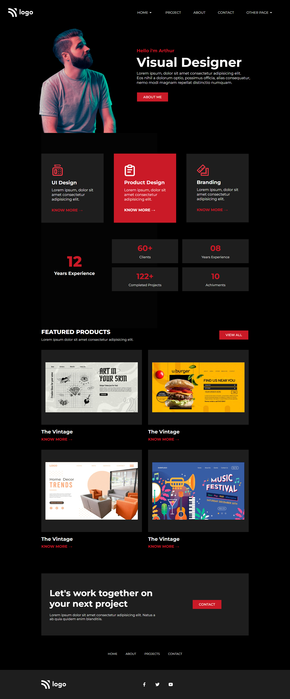

# **Khushal Shimpi**

## **Project - 15**

## **Project Title** - Product design landing page.
This is landing page made by using Html & Css.

##  Time to complete this project :-

## What I have Learned in this Project :-

- Layout Making Using - **Flexbox**.
- How to make - **Cards**
- How to insert - **Icons**
- How to Make - **Beautiful Buttons**.
- How to Make - **Portfolio**.

## Technology Used :-

Project  built from using

 
**&**

[Click Me](https://fantastic-mochi-c0d8bd.netlify.app/) to see the project Demo.

## Screenshot of  project :-

## Features :-

- Live previews
- Fullscreen mode
- Mobile responsive
- Tablet responsive

## 🔗 Links

